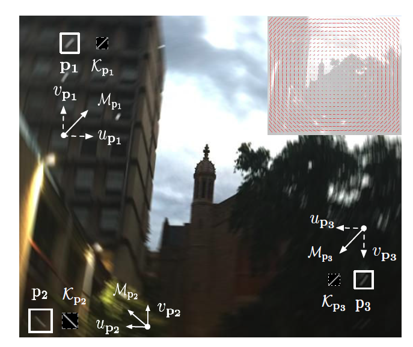

# Estimating Motion Flow for Blur Removal

## Heterogeneous Motion Blur Model

$$Y = K ∗ X + N$$

* Y = unscharfes Bild $P \times Q$
* K = heterogene motion blur kernel map mit verschiedenen motion blur kernel für jeden Pixel in X
* ∗ = allgemeiner convolution operator
* X = latentes scharfes Bild
* N = zusätzliches Bildrauschen

$$Y(i, j) = \sum\limits_{i´, j´} K_{(i, j)} (i´, j´) X (i + i´, j +j´)$$

* $K_{(i, j)}$ repräsentiert den Kernel aus K, der auf den Pixel (i, j) zentriert ist

$$y = H(K)x + n;$$

* vec() = vektorisiert eine Matrix
* y = vec(Y) 
* x = vec(X)
* n = vec(n)
* $H(K) ∈ \mathbb{R}^{PQ✖PQ}$ (jede Zeile entspricht einem blur kernel an jedem Pixel)

## Estimating Motion Flow for Blur Removal

Bei einem unscharfen Bild $Y$ ist das Ziel, den blur kernel $K$ zu bestimmen und ein unscharfes Bild $X$ durch eine non-blind deconvolution zu einem scharfen Bild wiederherzustellen.

  

Quelle: {cite:p}`gong2017blur2mf`

Basierend auf den bereits festgelegten Modellen, können blur kernel modelliert werden. Diese sind mit jedem Pixel und dessen Bewegung verbunden.  
Dabei besitzt ein Pixel $P = (i, j)$ einen 2 dimensionalen Bewegungsvektor $M_p = (u_p, v_p)$.

  

Quelle: {cite:p}`gong2017blur2mf`

