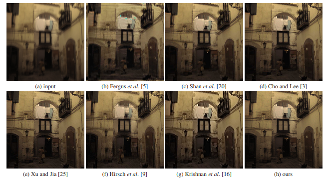
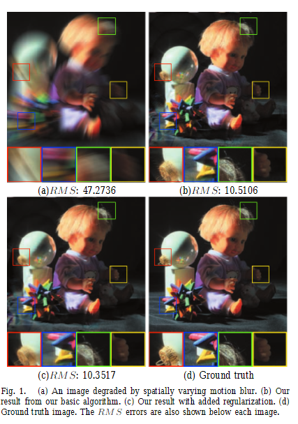

# Deblurring Theorien

## Konventionelles blind image deblurring

Bei den konventionellen blind image deblurring Methoden ist eine der grunsätzlichen Annahmen, dass die Bewegungsunschärfe spatially uniform ist und nicht heterogenous.  
In diesen Theorien wurden bereits mehrere Ansätze genauer betrachtet, um die Bewegungsunschärfe zu entfernen. Dazu gehören unter anderem:  
* total variational regularizer mit der Maximum-a-posteriori-Methode (MAP). Das Verfahren schätzt einen unbekannten Parameter durch den Modalwert der A-posteriori-Verteilung.
* Gaussian scale mixture priors, es wird angenommen, dass das Rauschen/ Blur gaußförmig ist.
* Analyse der Interaktion zwischen Bildregularisierern und den Auswirkungen von Unschärfe auf die hohen Frequenzen in einem Bild. Die Einführung eines neuartigen Regularisierers der die Abschwächung der hohen Frequenzen kompensiert und damit den Kernel-Schätzprozess stark stabilisiert ($l_1/ l_2$-Norm & $l_0 Norm$)

  
Quelle: {cite:p}`l0norm`

* Deblurring basierend auf dark channel based regularizers. Der Dark channel wird hauptsächlich zur Beschreibung der Minimalwerte in einem Bildausschnitt verwendet.

  
Quelle: {cite:p}`darkchannel`

Zusätzlich wurden mehrere Estimator untersucht, um robustere und zuverlässige Kernel zu berechnen. Mögliche Estimator sind:  
* edge-extraction-based maximum-a-posteriori (MAP)

  
Quelle: {cite:p}`edgebasedblur`

* gradient activation based MAP. Die  Methode basiert basiert auf der Beobachtung, dass nur eine Teilmenge der Gradienten des latenten Bildes für die kernel-estimation ausreichend ist
* variational Bayesian methods

Die Theorien, welche sich dieser Methoden annehmen, sind dabei aber sehr stark abhängig von den ersten Annahmen und Priors. Der praktische Einsatz dieser Theorien wird hierduch eingeschränkt.

## Spatially-varying blur removal

Um mit räumlich variierender Unschärfe umzugehen, werden flexiblere blur Modelle vorgeschlagen.  
* Ein Ansatz ist ein projektives projective motion path model,  die das unscharfe Bild als eine Integration einer klaren Szene unter einer Sequenz von projektiven Transformationen behandelt, die den Weg der Kamera beschreiben. 

  
Quelle: {cite:p}`motionPath`

* Ein weiterer Ansatz ist, die Kamerabewegugn als motion density function für non-uniform blur zu modellieren, die den Anteil der Zeit aufzeichnet, der in jedem diskretisierten Teil des Raums aller möglichen Kamerapositionen verbracht wird. 
* Um die Unschärfe, die durch die Bewegung von Objekten verursacht wird, zu behandeln, segmentieren einige Methoden Bilder in Bereiche mit unterschiedlichen Arten von Unschärfe und sind somit stark von einer akkuraten Segmentierung eines unscharfen Bildes abhängig. 
* Ein pixelweises lineares Bewegungsmodell, um mit heterogener Bewegungsunschärfe umzugehen. Obwohl die Bewegung als lokal linear angenommen wird, gibt es keine Annahmen über die latente Bewegung, was es flexibel genug macht, um einen großen Bereich möglicher Bewegungen zu behandeln. 

## Learning based motion blur removing

In den neusten Papern werden lernbasierte Methoden verwendet, um eine flexiblere und effizientere Unschärfeentfernung zu erreichen.  
Es wurden einige diskriminative Methoden für die nicht-blinde Dekonvolution vorgeschlagen, die auf
* Gaussian conditional random fields 
* Multi-Layer-Perceptron (MLP) 
* Deep Convolution Neural Network (CNN) 

basieren, die alle die bekannten blur-kernel benötigen. 
Einige End-to-End-Methoden wurden vorgeschlagen, um unscharfe Bilder zu rekonstruieren, allerdings können sie nur mit leichter Gaußscher Unschärfe umgehen.  
Die relevanteste Arbeit ist eine Methode, die auf CNN und der Klassifizierung des Unschärfetyps auf Patch-Ebene basiert, die sich ebenfalls auf die Schätzung des Bewegungsflusses aus einem einzelnen unscharfen Bild konzentriert. Dabei wird das CNN auf kleinen Patch-Beispielen mit gleichmäßiger Bewegungsunschärfe trainiert, wobei jedem Patch ein einzelnes Bewegungslabel zugewiesen wird, was die Natur der realen Daten verletzt und die Korrespondenz in größeren Bereichen ignoriert. Für den endgültigen dichten Bewegungsfluss sind viele Nachbearbeitungen wie Markov random field (MRF) erforderlich.
